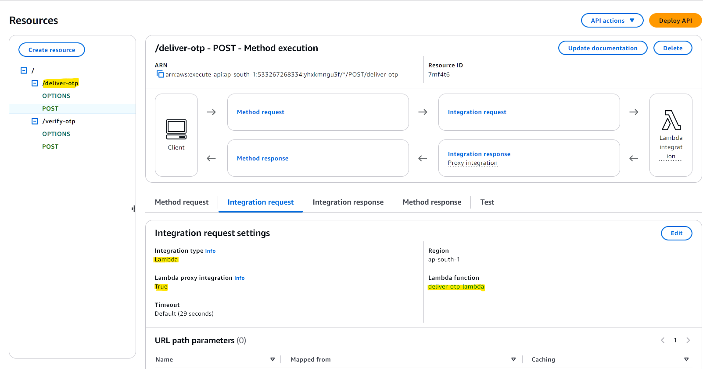
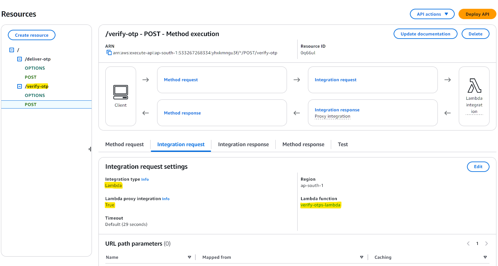

## POSTMAN COLLECTION: 

### Verify OTP : [generate-otp-lambda.py](../LAMBDA/generate-opt-lambda-cors-policy.py)
```sh
curl --location 'https://yhxkmngu3f.execute-api.ap-south-1.amazonaws.com/poc/generate-otp' \
--header 'Content-Type: application/json' \
--data-raw '{
  "user_id": "aritra.b",
  "method": "email",
  "recipient": "aritra.b@example.com"
}'
```
```sh
curl --location 'https://yhxkmngu3f.execute-api.ap-south-1.amazonaws.com/poc/generate-otp' \
--header 'Content-Type: application/json' \
--data-raw '{
  "user_id": "aritra.b",
  "method": "sms",
  "recipient": "+919831182097"
}'
```

### Verify OTP : [verify-otp-lambda.py](../LAMBDA/verify-opt-lambda-cors-policy.py)
```sh
curl --location 'https://yhxkmngu3f.execute-api.ap-south-1.amazonaws.com/poc/verify-otp' \
--header 'Content-Type: application/json' \
--data '{
  "user_id": "aritra",
  "otp_code": "159862"
}'
```


## Configure AWS API Gateway


