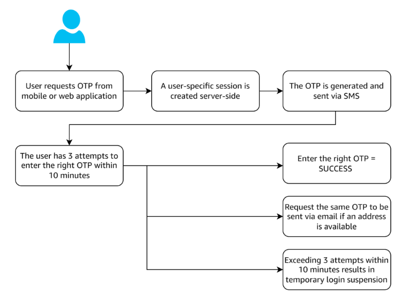
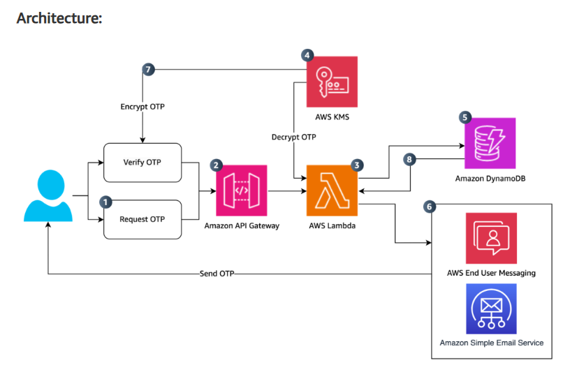

# OTP Service Setup Guide

* **Link: https://aws.amazon.com/blogs/messaging-and-targeting/build-a-secure-one-time-password-architecture-with-aws/**

__Application architecture__ <br>


__AWS architecture__ <br>


## Step 1: Create IAM Role for Lambda Functions
Run the following AWS CLI command to create the IAM role:
```bash
aws iam create-role --role-name otp-service-lambda-role-xbo4r961 \
  --assume-role-policy-document '{
    "Version": "2012-10-17",
    "Statement": [
      {
        "Effect": "Allow",
        "Principal": {
          "Service": "lambda.amazonaws.com"
        },
        "Action": "sts:AssumeRole"
      }
    ]
  }'
```

## Step 2: Attach Required Policies
Attach permissions to allow Lambda functions to interact with necessary AWS services.

### 2.1: DynamoDB Policy (Read/Write OTPs)
```shell
aws iam put-role-policy --role-name otp-service-lambda-role-xbo4r961 \
  --policy-name DynamoDBAccess \
  --policy-document '{
    "Version": "2012-10-17",
    "Statement": [
      {
        "Effect": "Allow",
        "Action": [
          "dynamodb:Query",
          "dynamodb:GetItem",
          "dynamodb:PutItem",
          "dynamodb:UpdateItem",
          "dynamodb:DeleteItem"
        ],
        "Resource": "arn:aws:dynamodb:ap-south-1:${AWS_ACCOUNT_ID}:table/otp_main"
      }
    ]
  }'
```

### 2.2: KMS Policy (Encrypt/Decrypt OTPs)
```shell
aws iam put-role-policy --role-name otp-service-lambda-role-xbo4r961 \
  --policy-name KMSAccess \
  --policy-document '{
    "Version": "2012-10-17",
    "Statement": [
      {
        "Effect": "Allow",
        "Action": ["kms:Encrypt", "kms:Decrypt"],
        "Resource": "arn:aws:kms:ap-south-1:${AWS_ACCOUNT_ID}:key/56733c0f-c7b9-4401-9cd7-9dd9ff1a92a4"
      }
    ]
  }'
```

### 2.3: SNS Policy (Send OTP via SMS)
```shell
aws iam put-role-policy --role-name otp-service-lambda-role-xbo4r961 \
  --policy-name SNSAccess \
  --policy-document '{
    "Version": "2012-10-17",
    "Statement": [
      {
        "Effect": "Allow",
        "Action": "sns:Publish",
        "Resource": "*"
      }
    ]
  }'
```

### 2.4: SES Policy (Send OTP via Email)
```shell
aws iam put-role-policy --role-name otp-service-lambda-role-xbo4r961 \
  --policy-name SESAccess \
  --policy-document '{
    "Version": "2012-10-17",
    "Statement": [
      {
        "Effect": "Allow",
        "Action": "ses:SendEmail",
        "Resource": "*"
      }
    ]
  }'
```

### 2.5: CloudWatch Logs Policy (For Debugging)
```shell
aws iam put-role-policy --role-name otp-service-lambda-role-xbo4r961 \
  --policy-name CloudWatchAccess \
  --policy-document '{
    "Version": "2012-10-17",
    "Statement": [
      {
        "Effect": "Allow",
        "Action": [
          "logs:CreateLogGroup",
          "logs:CreateLogStream",
          "logs:PutLogEvents"
        ],
        "Resource": "arn:aws:logs:${AWS_REGION}:*:*"
      }
    ]
  }'
```

## Step 3: Attach Role to Lambda Functions
Attach the IAM role to the Lambda functions:
```bash
aws lambda update-function-configuration --function-name generate-otp-lambda \
  --role arn:aws:iam::<your-account-id>:role/otp-service-lambda-role-xbo4r961
```
```bash
aws lambda update-function-configuration --function-name verify-otp-lambda \
  --role arn:aws:iam::<your-account-id>:role/otp-service-lambda-role-xbo4r961
```

## Step 4: Create a DynamoDB Table
Create a DynamoDB table to store OTPs.
```
Table Name: otp_main
Primary Key: id (String)
Attributes:
- id (String)
- otp (String)
- expiry (Number)
```

## Step 5: Create a KMS Key
```shell
aws kms create-key --profile <AWS_PROFILE>
```
Copy the key ID and update the `KMS_KEY_ID` variable in your script.

## Step 6: Deploy the Lambda Functions
Deploy using Serverless Framework:
```bash
serverless deploy --aws-profile <AWS_PROFILE>
```
